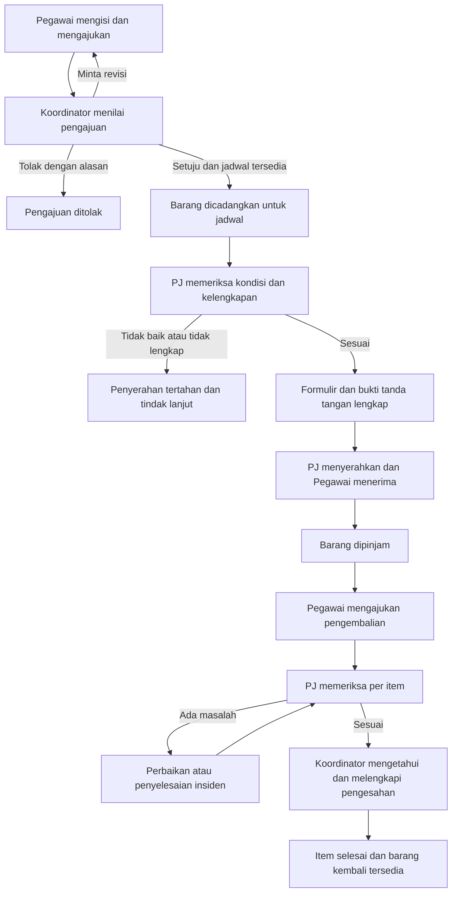
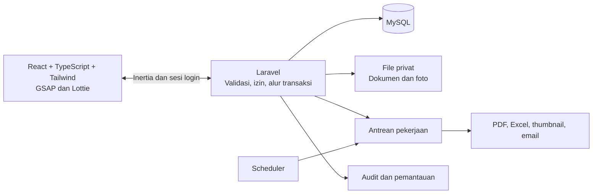

# Perencanaan SIMON — Sistem Informasi Barang Milik Negara

Versi: 1.0 — 14 September 2026  
Status: **RENCANA FITUR DAN ARAH DESAIN DI-ACC PENGGUNA; BERLANJUT KE PROMPT STITCH**  
Dasar: 66 dokumen asli pada folder kerja, pembacaan ulang teks SOP, inventaris dokumen, dan kebutuhan pengguna.  
Hasil tahap ini: rencana produk, role, alur, UI/UX, data, keamanan, migrasi, pengujian, dan tahapan implementasi. Prompt Google Stitch telah disusun setelah persetujuan rencana; lihat bagian 18. ACC rencana tidak menggantikan verifikasi mandat dan kebijakan operasional instansi.

## 1. Arah produk dan keputusan dasar

SIMON membantu pegawai mendapatkan barang kerja yang sesuai, membantu Penanggung Jawab Ruangan menjaga keberadaan dan kondisi barang, serta membantu Koordinator mengelola persetujuan, inventaris, dan pertanggungjawaban BMN.

Ukuran keberhasilan utamanya: pengguna memahami apa yang harus dilakukan berikutnya, cukup mengisi data yang diperlukan, bisa menemukan barang dan dokumen dengan cepat, serta dapat menelusuri siapa memegang barang dan apa kondisi terakhirnya.

| Aspek | Rancangan awal |
|---|---|
| Pengguna | Pegawai internal instansi |
| Lingkup organisasi | Balai Jambi, Seksi Wilayah I Medan, dan Seksi Wilayah II Palembang; struktur dapat dikonfigurasi |
| Role aplikasi | Pegawai, Penanggung Jawab Ruangan, Koordinator |
| Bentuk aplikasi | Website responsif untuk desktop, tablet, dan ponsel |
| Bahasa dan waktu | Bahasa Indonesia; tampilan waktu Asia/Jakarta/WIB; penyimpanan waktu transaksi konsisten di server |
| Stack | Laravel, React, TypeScript, Inertia.js, MySQL, Tailwind CSS, GSAP, Lottie |
| Gaya visual | Putih dominan, rapi, terang, teks terbaca, langkah kerja singkat |
| Dokumen | Format surat mengikuti dokumen asli yang diverifikasi; data surat diisi dari transaksi |
| Posisi terhadap aplikasi pemerintah | Register operasional, penelusuran, dan rekonsiliasi BMN; pencatatan referensi SIMAK/SAKTI/SIMAN sesuai dokumen yang tersedia |
| Integrasi eksternal | Ekspor/impor dan pencatatan referensi dahulu; integrasi langsung mengikuti ketersediaan akses resmi |

Asumsi desain sementara: satu instansi dengan tiga lokasi utama, pengguna internal dalam skala ratusan, dan aset dalam skala ribuan. Ini asumsi kapasitas untuk perencanaan, bukan hasil penghitungan pengguna aktif. Jumlah aset unik harus direkonsiliasi karena Excel, PDF, dan BAST dapat menyebut barang yang sama.

Kebutuhan yang belum ditentukan—tim pengembang, jadwal, hosting, domain, SMTP, dan pejabat berwenang—dicatat sebagai masukan untuk tahap implementasi. Rencana tidak mengunci estimasi biaya atau tanggal selesai sebelum hal tersebut diketahui.

## 2. Hubungan dokumen dengan fitur

Legenda: **SOP** = didasarkan pada SOP; **ARSIP** = berasal dari berkas pendukung; **TAMBAHAN** = usulan untuk mempermudah penggunaan. Tambahan belum dianggap disetujui sampai ACC.

| ID | Modul | Dasar dokumen | Perwujudan di SIMON | Prioritas |
|---|---|---|---|---|
| F01 | Akun dan akses | Permintaan pengguna | Login, register internal, lupa/reset password, verifikasi email, aktivasi akun, tiga role | Fondasi |
| F02 | Struktur organisasi dan ruangan | Struktur Unit BMN Gakkum Sumatera.png | Unit, wilayah, ruangan, penugasan PJ, cakupan Koordinator, daftar pejabat penandatangan | Fondasi |
| F03 | Register aset | Daftar Aset BMN Balai Sumatera.xlsx; inventaris; data ASP | Satu riwayat aset, identitas BMN, foto, kondisi, lokasi, nilai, pemegang, dokumen | Fondasi |
| F04 | Katalog dan pencarian barang | TAMBAHAN untuk SOP peminjaman | Cari/filter, foto, ketersediaan berdasarkan tanggal, ringkasan aturan pinjam | Inti |
| F05 | Peminjaman sementara | SOP PEMINJAMAN.pdf; formulir | Pengajuan, persetujuan Koordinator, cek fisik PJ, serah-terima, riwayat | Inti |
| F06 | Pengembalian | SOP PENGEMBALIAN.pdf; formulir | Permintaan kembali, pemeriksaan, perbedaan kondisi, perbaikan, pengesahan penutupan | Inti |
| F07 | Penetapan pemegang aset | SOP Pinjam Pakai Aset.pdf; DAFTAR BMN LAPTOP.xlsx; 34 BAST laptop | Penunjukan laptop/kendaraan dinas, BAST personal, pemegang aktif, serah balik/penggantian pemegang | Inti |
| F08 | Distribusi dan mutasi | SOP Pendistribusian BMN.pdf; BAST BMN KLH - Balai Sum | Penerimaan, pengkodean, penyaluran antarunit/ruangan, tanda terima, laporan | Pelengkap SOP |
| F09 | Inventarisasi dan DBR | SOP Inventarisasi BMN.pdf; Kertas Kerja Inventarisasi.pdf; inventaris foto | Sesi cek fisik, daftar barang ruangan, temuan, kertas kerja, review bertingkat, arsip | Inti |
| F10 | Kerusakan dan perawatan | SOP pengembalian; matriks SPIP | Laporan masalah, bukti kondisi, pekerjaan perbaikan, hasil pemeriksaan | Inti dasar |
| F11 | Usulan penghapusan | SOP Penghapusan BMN.pdf | Usulan, opname, penelitian/harga limit, pengesahan, SK, arsip status penghapusan | Pelengkap SOP |
| F12 | Laporan dan SPIP | SOP Penyusunan Laporan BMN.pdf; folder Data SPIP | Laporan periodik, review/pengesahan, matriks risiko BMN, bukti dan tindak lanjut | Pelengkap SOP |
| F13 | Surat dan arsip | Seluruh formulir dan BAST; template stiker | Generate draf, penomoran, versi, cetak/unduh, unggah salinan sah, arsip terkait transaksi | Inti |
| F14 | Label NUP dan QR | Tiga Stiker NUP.pdf; TAMBAHAN QR | Cetak label resmi yang disesuaikan; QR internal untuk membuka aset | Inti |
| F15 | Transisi ASP/PSP | Dua berkas BAST BMN LIQUIDASI KLHK | Register asal/tujuan, status proses, referensi tiket dan BAST, rekonsiliasi identitas | Pelengkap arsip |
| F16 | Notifikasi dan pusat tugas | Permintaan pengguna; TAMBAHAN UX | Dialog di tengah, pusat notifikasi, tugas tertunda, reminder jatuh tempo | Inti |
| F17 | Impor dan kualitas data | Empat Excel; PDF; PNG; DOC/DOCX | Area penampungan, pemetaan, validasi, duplikasi, koreksi, persetujuan impor | Fondasi |
| F18 | Jejak aktivitas dan keamanan | Permintaan pengguna | Catat perubahan, akses berdasarkan kewenangan, proteksi file, pencadangan dan pemulihan | Fondasi |

Halaman identitas `Hal 1 SOP.pdf` memiliki kolom nomor, tanggal efektif, dan pengesahan yang belum terisi pada teks yang dibaca. Sebelum digunakan sebagai aturan operasional final, instansi perlu menetapkan versi SOP aktif dan pejabat yang berwenang. Rencana ini menerjemahkan alur yang tersedia; tidak menyatakan dokumen tersebut telah disahkan.

## 3. Role, wilayah, dan kewenangan

### 3.1 Pegawai — peminjam/pemegang

- Melihat katalog barang yang diizinkan untuk unitnya dan tanggal peminjaman yang dipilih.
- Mengajukan pinjaman satu atau beberapa barang, memantau status, memperbaiki pengajuan, membatalkan sebelum serah-terima, dan meminta perpanjangan.
- Melihat tempat pengambilan, PJ yang menangani, checklist kelengkapan, dan dokumen yang perlu dipenuhi.
- Mengonfirmasi barang diterima, mengajukan pengembalian, serta melaporkan kerusakan/kehilangan dengan foto dan kronologi.
- Melihat **Barang Saya**: pisahkan barang pinjaman sementara dan aset yang ditetapkan sebagai tanggung jawab jangka panjang.
- Mengakses surat dan riwayat yang berhubungan dengan dirinya.
- Mengubah profil dasar, password, preferensi notifikasi, dan keamanan akun. Perubahan NIP/unit resmi melalui verifikasi pengelola.
- Mengakses panduan singkat dan SOP yang relevan.

### 3.2 Penanggung Jawab Ruangan — pelaksana operasional

- Melihat seluruh barang pada ruangan yang secara resmi ditugaskan kepadanya, termasuk bila menangani lebih dari satu ruangan.
- Mendapat antrean **Siapkan Barang**, **Serah-Terima**, **Periksa Pengembalian**, dan **Cek Fisik**.
- Menyiapkan barang yang telah mendapat persetujuan Koordinator; mencatat foto, kondisi, kelengkapan, dan hasil pemeriksaan.
- Memproses serah-terima dan penerimaan fisik, termasuk pengembalian sebagian barang.
- Memperbarui observasi kondisi/lokasi melalui alur tercatat; mengusulkan koreksi identitas master kepada Koordinator.
- Melaksanakan inventarisasi, mengisi kertas kerja, dan mengirim hasil untuk direview.
- Mengusulkan perpindahan ruangan, perawatan, atau penghapusan barang berdasarkan temuan.
- Melihat laporan ruangan dan bukti yang berkaitan dengan tanggung jawabnya.

PJ tidak otomatis menjadi pemberi persetujuan pinjaman. SOP menempatkan persetujuan pada Koordinator/Subkoordinator, kemudian pemeriksaan fisik pada PJ. Pergantian urutan ini memerlukan revisi SOP, sehingga rancangan awal mempertahankannya.

### 3.3 Koordinator — pengelola dan pemberi persetujuan

- Memantau seluruh unit yang menjadi cakupan penugasannya.
- Menyetujui, menolak, atau meminta revisi pengajuan pinjaman dan perpanjangan; menutup pengembalian setelah pemeriksaan lengkap.
- Mengelola register aset, penetapan pemegang, distribusi, mutasi, dan status peralihan.
- Menetapkan jadwal inventarisasi serta memeriksa hasil dan kelengkapannya.
- Mengelola proses usulan penghapusan dan pencatatan bukti pengesahan pejabat berwenang.
- Menyusun dan mengesahkan secara internal laporan, kemudian mencatat pengesahan pejabat yang dipersyaratkan SOP.
- Mengelola template surat, register nomor, SOP aktif, data unit/ruangan, aturan peminjaman, dan kalender kerja.
- Mengelola pendaftaran pegawai dan penugasan PJ sesuai wilayahnya.
- Melihat audit aktivitas, kualitas data, dan ringkasan kesehatan layanan yang relevan.

Hak administrasi sensitif seperti penetapan Koordinator lain dan pengaturan global hanya diberikan kepada akun Koordinator yang mendapat mandat administrasi. Ini adalah izin terperinci dalam role Koordinator, bukan role aplikasi keempat. Mandat tidak dapat diberikan kepada diri sendiri dari antarmuka biasa; aktivasi awal dilakukan lewat prosedur setup yang tercatat, tanpa akun/password bawaan publik.

### 3.4 Matriks hak akses

| Kegiatan | Pegawai | PJ Ruangan | Koordinator |
|---|---|---|---|
| Melihat katalog yang diizinkan | Ya | Ya | Ya |
| Melihat nilai rinci, dokumen pemegang lain | Tidak secara umum | Sesuai kebutuhan ruangan/mandat | Sesuai cakupan |
| Mengajukan pinjaman pribadi | Ya | Ya, sebagai peminjam | Ya, sebagai peminjam |
| Menyetujui pengajuan | Tidak | Tidak | Ya, sesuai cakupan dan bukan milik sendiri |
| Memeriksa dan menyerahkan fisik | Konfirmasi penerimaan sendiri | Ya, ruangan penugasan | Memantau/menugaskan pelaksana |
| Mengajukan pengembalian | Barang sendiri | Barang sendiri | Barang sendiri |
| Memeriksa pengembalian | Tidak | Ya, penugasan terkait | Review/penutupan sesuai SOP |
| Mengubah kode/NUP/nilai master | Tidak | Usulan koreksi | Ya, perubahan tercatat |
| Melaporkan kerusakan | Barang sendiri/yang terkait | Ruangan penugasan | Semua dalam cakupan |
| Melakukan cek fisik | Konfirmasi lokasi bila diminta | Ya | Menugaskan dan mereview |
| Mengusulkan penghapusan | Melaporkan kondisi | Ya | Meneliti/memproses dan melampirkan pengesahan |
| Finalisasi penghapusan administratif | Tidak | Tidak | Setelah persetujuan dan bukti yang diwajibkan |
| Menyusun laporan | Riwayat sendiri | Laporan ruangan | Laporan unit/instansi dalam cakupan |
| Mengunduh arsip | Dokumen terkait dirinya | Dokumen terkait ruangan/pekerjaan | Sesuai cakupan |
| Mengaktifkan akun dan menunjuk PJ | Tidak | Tidak | Dengan mandat dan cakupan yang sesuai |
| Mengubah hak Koordinator/global | Tidak | Tidak | Hanya yang mendapat mandat khusus |

### 3.5 Pemetaan jabatan dalam SOP ke tiga role

SOP menyebut Koordinator, Subkoordinator, Kepala Tata Usaha, pengguna/peminjam, PJ ruangan, dan pengadministrasi. Role login dan jabatan penandatangan harus disimpan terpisah.

- **Subkoordinator:** dapat memakai role Koordinator dengan cakupan unit terbatas dan mandat review lokal. Bila proses meminta dua pemeriksa, sistem membuat dua tahap: Subkoordinator lalu Koordinator, oleh dua orang yang berbeda.
- **Kepala Tata Usaha/Kepala Balai:** awalnya dicatat sebagai pejabat pengesah beserta dokumen pengesahan/hasil tanda tangan yang diunggah. Bila perlu login, dapat menggunakan role Koordinator dengan mandat tahap pengesahan tertentu.
- **Pengadministrasi:** pengarsipan digital ditangani modul arsip; pengiriman ke administrasi dicatat dengan tanggal, penerima, dan bukti.
- Ketentuan mandat dan perangkapan jabatan perlu ACC organisasi. Sistem tidak boleh memberi hak menyetujui hanya karena seseorang dicantumkan namanya di surat.
- Tidak boleh menyetujui pengajuan sendiri atau memverifikasi serah-terima pribadi sebagai kedua pihak. Pengganti resmi dapat menangani dengan mandat berjangka. Jika tidak ada pemeriksa berbeda, tugas tertahan dengan keterangan yang jelas.
- Perubahan penugasan PJ/Koordinator tidak boleh memutus pekerjaan terbuka; harus ada alih tugas dan riwayat kewenangan yang berlaku saat keputusan dibuat.

## 4. Rancangan fitur per modul

### F01 — Akun, login, register, lupa password

**Login:** email dan password, tombol mata, tampilkan/sembunyikan password, indikator Caps Lock, tautan lupa password, tautan daftar, bantuan, serta pesan error yang tidak membocorkan apakah akun ada. Dukungan password manager dan paste tetap tersedia.

**Register internal:** nama, email aktif, NIP bila berlaku, unit kerja, password, konfirmasi password. Unit yang dipilih adalah permintaan penempatan, bukan hak akses yang langsung berlaku. Semua pendaftaran otomatis berstatus Pegawai menunggu verifikasi/aktivasi; tidak ada pemilihan role Koordinator/PJ dari halaman daftar.

Alur: daftar → verifikasi email → Koordinator memeriksa kecocokan pegawai/unit → akun aktif. Akun yang belum aktif hanya dapat melihat halaman status, bantuan, profil terbatas, dan kirim ulang verifikasi dengan pembatasan frekuensi.

**Lupa password:** pengguna memasukkan email → dialog tengah menampilkan pesan netral → tautan reset sekali pakai dikirim bila akun memenuhi syarat → halaman password baru dan konfirmasi → sukses → login ulang. Kedua kolom password baru memiliki ikon mata. Halaman meminta email memang tidak mempunyai kolom password, sehingga ikon mata berada pada tahap reset. Token kedaluwarsa memberi pilihan meminta tautan baru. Reset tidak mengaktifkan akun yang masih ditangguhkan.

**Keamanan akun:** password minimum usulan 15 karakter, mendukung passphrase, pemeriksaan password umum/bocor bila mekanisme tersedia dan disetujui, rate limit, riwayat sesi, keluar dari perangkat lain, autentikasi dua faktor wajib untuk Koordinator dan PJ serta opsional bagi Pegawai. Recovery code ditampilkan hanya kepada pemilik akun. Proses pemulihan MFA memerlukan verifikasi identitas dan pencatatan.

Tautan reset harus acak, terbatas masa berlakunya, sekali pakai, serta respons permintaan dibuat seragam. Dasar: [OWASP Forgot Password](https://cheatsheetseries.owasp.org/cheatsheets/Forgot_Password_Cheat_Sheet.html). Masa berlaku dan batas percobaan dikonfigurasi; usulan awal token 30 menit, dengan pengujian keterkiriman email sebelum ditetapkan.

### F02–F04 — Struktur, register aset, dan katalog

Struktur: instansi → unit/wilayah → gedung bila diperlukan → ruangan → penugasan PJ. Satu akun dapat menangani beberapa ruangan melalui penugasan eksplisit.

Setiap aset mempunyai ID internal permanen dan data berikut:

- Kode satker, kode barang, NUP, kategori, nama barang, merek, tipe, spesifikasi, serial number bila ada.
- Tahun/tanggal perolehan, sumber pengadaan, penyedia, nilai perolehan, dan nilai buku hanya bila tersedia dari sumber yang sah.
- Satker asal, identitas lama, tujuan transfer, referensi BAST, status PSP/ASP, serta referensi pencatatan aplikasi pemerintah.
- Unit dan ruangan pemilik/pengelola, lokasi fisik terakhir, PJ, dan pemegang aktif.
- Kondisi B/Baik, RR/Rusak Ringan, RB/Rusak Berat; tanggal dan pelaksana pemeriksaan.
- Foto barang dari beberapa sisi, foto label, kelengkapan, koordinat bila diperlukan, dan bukti dokumen.
- Kebijakan apakah barang dapat dipinjam, lama pinjam, perlu pelatihan/penugasan khusus, dan apakah termasuk satu paket.

Kode/NUP/NIP disimpan sebagai teks agar nol awal atau digit panjang tidak berubah. Nilai uang memakai tipe desimal. Satu baris aset mewakili unit atau paket sesuai pencatatan BMN; paket dapat memiliki checklist komponen tanpa otomatis menggandakan nilai aset.

Katalog menampilkan foto ringan, nama, jenis, lokasi yang diizinkan, status, dan tombol **Ajukan Peminjaman**. Filter: kategori, unit/ruangan, kondisi, tanggal, ketersediaan. Hasil kosong menawarkan mengubah filter atau tanggal. Data pribadi pemegang lain dan nilai aset tidak muncul secara umum di katalog Pegawai.

Halaman detail aset: **Ringkasan**, **Kondisi & Foto**, **Pemegang/Lokasi**, **Riwayat**, dan **Dokumen**. Tab disesuaikan dengan izin; data yang dilarang tidak ikut dikirim ke browser.

### F05 — Peminjaman sementara

Form memakai tiga langkah: **Pilih barang dan tanggal → Keperluan/pengambilan → Periksa dan ajukan**. Identitas pegawai terisi otomatis. Lampiran hanya diwajibkan untuk jenis kegiatan/barang tertentu. Pengajuan dapat disimpan sebagai draf.

Pengguna melihat alasan bila barang tidak dapat dipinjam dan siapa yang sedang memproses pengajuan. Detail menampilkan linimasa, tanggal rencana pengambilan/pengembalian, tempat, persyaratan serah-terima, dan langkah berikutnya.

Fitur tambahan untuk kenyamanan: ajukan ulang dari riwayat dengan pemeriksaan ketersediaan baru, permintaan perpanjangan, dan pembatalan sebelum barang diserahkan. Penolakan, revisi, dan pembatalan setelah disetujui membutuhkan alasan. Perpanjangan harus direview dan tidak boleh menimpa reservasi orang lain.

### F06 dan F10 — Pengembalian, kerusakan, perawatan

Pegawai memilih barang yang akan dikembalikan dan menjadwalkan penyerahan. PJ membandingkan kondisi sebelum/sesudah dan checklist kelengkapan. Pengembalian sebagian didukung per item; item lain tetap berada dalam tanggung jawab peminjam.

Jika kondisi sesuai, formulir pengembalian dilengkapi dan Koordinator menyelesaikan tahap diketahui/pengesahan. Jika berbeda, sistem mencatat masalah, bukti, tanggapan peminjam, dan rencana tindak lanjut. Barang ditahan dari ketersediaan sampai pemeriksaan/perbaikan selesai. Biaya, tanggung jawab ganti rugi, dan keputusan kehilangan tidak ditetapkan otomatis oleh aplikasi.

Perawatan mencatat kerusakan, pihak yang menangani, jadwal, biaya bila tersedia, bukti pekerjaan, dan pemeriksaan setelah perbaikan. Barang dengan kondisi belum baik tidak dapat diserahkan melalui jalur pinjaman biasa. Kejadian kehilangan disimpan sebagai insiden dan hasil pemeriksaan, bukan kategori kondisi fisik baru yang dicampur dengan B/RR/RB.

### F07 — Penetapan pemegang aset

Mendukung laptop, kendaraan dinas, dan barang yang digunakan jangka panjang. Modul mengikuti SOP Pinjam Pakai Aset dan BAST penanggung jawab: penetapan calon pemegang, pemeriksaan kelengkapan data, surat penunjukan/draf BAST, pengesahan pejabat, serah-terima, dan pemegang aktif.

Ada tanggal mulai, dokumen dasar, serta tanggal review/akhir bila relevan. Penetapan dapat berlaku sampai ditarik kembali; tidak dipaksa menjadi pinjaman harian yang selalu terlambat. Pergantian pegawai/unit dan serah balik memiliki berita acara tersendiri. Riwayat pemegang tidak ditimpa.

### F08 — Penerimaan, distribusi, dan mutasi

Penerimaan barang mengacu BAST sumber, jumlah, identitas BMN, kondisi, sumber pengadaan, dan tujuan. Koordinator mereview catatan, menetapkan lokasi, dan membuat tugas pelabelan/penyerahan. PJ penerima mengonfirmasi barang fisik.

Perpindahan ruangan/unit mencatat lokasi asal, tujuan, alasan, tanggal, pihak pengirim dan penerima. Aset diberi status dalam proses transfer sampai penerimaan selesai. Perubahan lokasi administratif dan pemindahan barang fisik dicatat terpisah bila tanggalnya berbeda.

Peminjaman lintas unit untuk rilis awal menggunakan persetujuan Koordinator yang cakupannya meliputi unit pemilik, dan PJ di unit asal melaksanakan serah-terima. Jika mandat belum meliputi kedua unit, diarahkan ke Koordinator instansi yang berwenang.

### F09 — Inventarisasi dan daftar barang ruangan

Koordinator membuat sesi inventarisasi, periode, ruangan, dan penugasan. PJ menerima daftar aset yang diharapkan berada di ruangan. Cek fisik dapat lewat QR atau pencarian manual.

Hasil setiap barang: ditemukan sesuai, berbeda lokasi, berbeda identitas, belum ditemukan, atau barang tambahan yang belum terdaftar. Catat kondisi, foto, kelengkapan, tanggal, pemeriksa, dan koordinat bila relevan. Temuan memerlukan rekonsiliasi; tidak langsung mengubah semua master saat sesi masih draf.

Sistem menghasilkan DBR dan kertas kerja dari snapshot sesi. Review mengikuti mandat Subkoordinator → Koordinator → Kepala TU sesuai SOP. Perbaikan dikembalikan dengan catatan per temuan. Finalisasi memerlukan bukti pengesahan yang ditentukan. Kertas kerja final menjadi arsip yang dapat diperiksa kembali.

### F11 — Usulan penghapusan

PJ mengusulkan aset rusak berat dengan hasil opname dan foto. Koordinator mengelola penelitian, usulan harga limit yang berasal dari petugas/hasil penilaian, berita acara, dan surat permohonan. Pengesahan serta SK dari pejabat berwenang disimpan.

Status **Dihapus** baru dapat ditetapkan setelah persyaratan dokumen lengkap dan proses resmi telah dikonfirmasi. Aplikasi menyimpan aset dan seluruh riwayatnya dalam arsip; tidak menghapus baris transaksi. Pembatalan atau koreksi memerlukan prosedur tercatat.

Tidak ada perhitungan harga limit otomatis, keputusan lelang, atau penghapusan otomatis pada SIMAK/SAKTI/SIMAN di rencana awal. Referensi dan tanggal tindak lanjut sistem resmi dicatat untuk rekonsiliasi.

### F12 — Laporan dan SPIP

Laporan mencakup aset per lokasi/kategori/kondisi, DBR, pemegang, pinjaman aktif/terlambat, pengembalian, pemeliharaan, mutasi, inventarisasi, usulan penghapusan, dan status ASP/PSP. Ekspor PDF/Excel dibatasi menurut role serta wilayah.

Periode laporan menggunakan snapshot agar laporan bulan lalu tidak berubah ketika master hari ini diperbarui. Alur: penugasan/disposisi → draf unit → review/koreksi → gabungan → pengesahan → pengiriman → arsip. Rekap nilai hanya menggabungkan aset unik yang lolos rekonsiliasi.

SPIP tahap awal berfokus pada BMN: risiko kerusakan/kehilangan, pengendalian inventarisasi/perawatan, penanggung jawab, hasil, efektivitas yang dinilai petugas, tindak lanjut, tenggat, dan bukti. Matriks asli yang juga memuat keuangan, kepegawaian, sosialisasi, dan SAKIP tetap dapat diarsipkan. Pengembangan sistem bisnis bidang-bidang itu memerlukan lingkup tambahan.

### F13 — Surat, template, dan arsip

Dokumen yang direncanakan:

| Dokumen keluaran | Acuan | Perlakuan |
|---|---|---|
| Formulir peminjaman dan pengembalian | Formulir PDF dan DOCX | Rekonstruksi isian sesuai layout, pastikan semua bagian kedua format terwakili |
| BAST penanggung jawab personal | 34 BAST laptop | Template umum dengan variasi jenis aset dan identitas penerima |
| BAST kolektif/antarunit | BAST B.190, B.2, B.3, B.55, dan lainnya | Surat induk dengan lampiran dinamis, nomor halaman, dan tanda tangan |
| Surat penunjukan penggunaan | SOP Pinjam Pakai Aset | Format baru yang perlu review karena contoh surat lengkap belum teridentifikasi |
| Kertas kerja inventarisasi | Kertas Kerja Inventarisasi.pdf | Tabel per ruangan, hasil kondisi, dan paraf/pengesahan |
| DBR dan laporan inventaris foto | Excel/PDF inventaris | Format laporan yang konsisten dengan data tersaring |
| Stiker NUP | Stiker Balai, SW I, SW II | Ukuran/layout cetak diverifikasi; QR ditambahkan tanpa menutupi identitas BMN |
| Surat usulan penghapusan/berita acara opname | SOP Penghapusan | Draf format baru; memerlukan contoh resmi/review sebelum final |
| Laporan BMN dan matriks SPIP | SOP pelaporan dan DOC SPIP | Snapshot periode, bukti terkait, tanda tangan/pengesahan |
| Arsip penggunaan sementara/ASP | BAST liquidasi | Arsip asli dan register referensi; penerbitan dokumen baru hanya setelah mandat/format terkonfirmasi |

PDF scan diperlakukan sebagai acuan tampilan dan arsip, bukan langsung sebagai template field yang dapat diedit. Tanda tangan dan cap dari arsip lama tidak dipotong atau ditempel otomatis ke surat baru.

Fitur template: kop/logo resmi, identitas instansi, daftar pejabat dan masa jabatan, tempat/tanggal, format nomor per jenis/unit/tahun, isi tetap yang direview, field transaksi, dan lampiran yang dapat menjadi banyak halaman. Pratinjau tersedia sebelum finalisasi.

Siklus dokumen: **Draf → Direview → Siap ditandatangani → Ditandatangani/diunggah → Diverifikasi → Arsip final**. Klik persetujuan internal dicatat sebagai tindakan pengguna, bukan otomatis dianggap tanda tangan elektronik tersertifikasi atau tanda tangan pejabat pada dokumen.

Untuk formulir yang SOP-nya mewajibkan tanda tangan sebelum penyerahan, simpan bukti penandatanganan lengkap sebelum transaksi serah-terima ditutup. Alur awal mendukung cetak, tanda tangan basah, dan unggah scan/foto; integrasi TTE resmi menjadi opsi berikutnya. Kolom status dokumen ditampilkan terpisah dari status barang agar pengguna tahu apa yang kurang.

Nomor surat dialokasikan oleh server dengan pemeriksaan unik dan transaksi database. Nomor yang sudah terbit tetapi dibatalkan dicatat sebagai batal dan tidak dipakai ulang. Dokumen final menyimpan versi template, snapshot nama/jabatan dan data aset, waktu penerbitan, pembuat, checksum, serta riwayat revisi. Koreksi menghasilkan versi/dokumen pengganti dengan alasan.

### F14–F15 — Label, QR, dan register ASP/PSP

QR berisi ID acak/tautan internal aset. Pengguna yang memindai tetap harus login dan lolos izin; QR tidak memberi akses otomatis dan tidak menyimpan NIP, nilai, atau tanda tangan. Ponsel tanpa izin kamera memiliki pilihan mencari kode/NUP manual.

Register ASP/PSP mencatat identitas dan satker asal/tujuan, status sementara, tanggal, tiket, dokumen, catatan, serta keterkaitan ke aset internal. Aset yang berpindah identitas tetap memiliki riwayat ID internal yang sama setelah diverifikasi. Status yang diimpor disimpan sebagaimana sumbernya dan dipetakan ke istilah SIMON lewat review.

## 5. Alur utama dan aturan status

### 5.1 Peminjaman sementara

Status pengajuan menggunakan bahasa pengguna: Draf, Menunggu Persetujuan, Perlu Revisi, Ditolak, Disetujui, Sedang Disiapkan, Siap Diambil, Aktif, Pengembalian Sebagian, Menunggu Penutupan, Selesai, Dibatalkan, Kedaluwarsa. Status item dan peristiwa disimpan terpisah sehingga satu pengajuan beberapa barang dapat selesai bertahap.

Label **Terlambat** dihitung dari tanggal jatuh tempo pada item yang belum selesai; bukan status yang menghapus posisi sebenarnya dalam alur. Pada usulan awal, persetujuan dilakukan untuk isi pengajuan yang utuh; perubahan daftar barang setelah persetujuan memerlukan revisi dan pemeriksaan ulang. Serah-terima fisik dapat dilakukan per item.

### 5.2 Pengembalian dan ketersediaan

Pegawai menekan **Ajukan Pengembalian** tidak berarti barang telah kembali. Waktu dikembalikan secara fisik, hasil pemeriksaan PJ, dan penutupan administratif oleh Koordinator dicatat sebagai peristiwa berbeda. Usulan awal: barang masuk **Menunggu Pemeriksaan/Penutupan** dan baru tersedia setelah rangkaian penutupan selesai; pengingat membantu agar tahap administratif tidak menahan barang terlalu lama.

Untuk pengembalian bermasalah, simpan bukti kondisi sebelum/sesudah, kronologi, tanggapan, keputusan, dan hasil pemeriksaan ulang. Barang tetap tidak tersedia selama masalah yang menghalangi penggunaan belum diselesaikan.

### 5.3 Aset, kondisi, jadwal, dan dokumen dipisahkan

| Dimensi | Contoh |
|---|---|
| Kondisi fisik | Baik, Rusak Ringan, Rusak Berat |
| Penguasaan/penggunaan | Di ruangan, dipinjam, ditetapkan ke pegawai, dalam transfer |
| Kesiapan operasional | Siap, menunggu pemeriksaan, perawatan, dinonaktifkan |
| Jadwal | Rentang waktu reservasi/peminjaman |
| Siklus administratif | Aktif, diusulkan penghapusan, dihapus/arsip |
| Status dokumen | Draf, menunggu tanda tangan, final, dibatalkan/diganti |

**Tersedia** merupakan hasil gabungan kondisi, kebijakan pinjam, penguasaan, serta jadwal. Contoh: barang berkondisi Baik yang sedang dipinjam tetap tidak tersedia; barang baru kembali tetapi belum diperiksa tidak ditampilkan siap dipakai.

### 5.4 Aturan lintas modul

- Dua permintaan tidak boleh mendapat persetujuan yang bentrok untuk unit aset dan rentang waktu yang sama. Pemeriksaan dilakukan lagi di server dengan penguncian baris aset/transaksi database ketika persetujuan, perpanjangan, dan serah-terima diproses.
- Pengajuan menunggu persetujuan belum memblokir semua orang; reservasi efektif pada persetujuan. Jika kalah dalam pemeriksaan jadwal, Koordinator melihat opsi revisi tanggal/barang.
- Durasi termasuk waktu persiapan/pemeriksaan bila ditetapkan instansi. Usulan masa ambil setelah persetujuan ditetapkan lewat konfigurasi, bukan di-hardcode tanpa kebijakan.
- Barang rusak, hilang, sedang dirawat, dalam transfer, atau sudah dihapus tidak dapat melewati jalur penyerahan biasa.
- Perubahan kepemilikan, lokasi, pemegang, perawatan, dan pinjaman menggunakan pengecekan konflik yang sama.
- Klik ganda/retry jaringan harus menghasilkan satu transaksi/satu nomor surat. Aksi penting memakai kunci idempotensi dan pemeriksaan status terkini.
- Alasan keputusan wajib pada penolakan, revisi, pembatalan, koreksi data inti, dan pergantian penanggung jawab.
- Target waktu mengikuti nilai dan satuan per langkah SOP yang telah disahkan. **Jam** pada dokumen tidak langsung diasumsikan sebagai jam kalender atau jam kerja; kalender kerja, hari libur, serta tenggat dikonfigurasi dan direview.
- Tenggat memicu pengingat/escalation task, tidak pernah persetujuan otomatis.

## 6. Dashboard, navigasi, dan halaman

### 6.1 Dashboard sesuai pekerjaan

| Role | Informasi paling atas | Aksi utama |
|---|---|---|
| Pegawai | Pinjaman aktif, mendekati jatuh tempo, siap diambil, pengajuan perlu revisi | Cari Barang; Kembalikan; Lihat Barang Saya |
| PJ Ruangan | Barang harus disiapkan, jadwal serah-terima, pengembalian menunggu cek, temuan ruangan | Buka Tugas; Scan QR; Mulai Cek Fisik |
| Koordinator | Persetujuan tertunda, inventaris belum lengkap, pengembalian belum ditutup, usulan/risiko yang perlu keputusan | Buka Persetujuan; Tinjau Temuan; Buat Laporan |

Kartu statistik secukupnya. Daftar pekerjaan yang perlu tindakan ditempatkan sebelum grafik. Setiap angka bisa diklik menuju daftar dengan filter yang sesuai. Waktu pembaruan data terlihat.

### 6.2 Struktur menu

- **Pegawai:** Beranda, Katalog Barang, Pengajuan Saya, Barang Saya, Dokumen Saya, Bantuan. Notifikasi dan profil berada pada area bersama.
- **PJ:** Beranda, Tugas Saya, Barang Ruangan, Serah-Terima, Pengembalian, Inventarisasi, Kerusakan & Perawatan, Laporan Ruangan, Dokumen & Panduan.
- **Koordinator:** Beranda, Persetujuan, Aset, Transaksi, Inventarisasi, Laporan & SPIP, Dokumen, Administrasi. Submenu Transaksi berisi penetapan, distribusi/mutasi, perawatan, penghapusan, ASP/PSP; Administrasi berisi pengguna, unit/ruangan, mandat, template, impor, aturan, dan audit.

Menu ditampilkan sesuai izin. Fitur dasar sebagai peminjam tersedia bagi PJ/Koordinator melalui halaman **Barang Saya/Pengajuan Saya** pada profil/menu pribadi; membuka konteks ini tidak mengubah hak akses backend.

### 6.3 Daftar halaman untuk tahap desain

| Kelompok | Halaman dan keadaan yang perlu didesain |
|---|---|
| Autentikasi | Login, register, status pendaftaran, verifikasi email, lupa password, instruksi email terkirim, reset password, token tidak valid/kedaluwarsa, tantangan 2FA, recovery, sesi berakhir |
| Bersama | Notifikasi, detail notifikasi, profil, keamanan akun, panduan/SOP, pencarian, tidak berwenang, tidak ditemukan, gangguan layanan |
| Pegawai | Dashboard, katalog, detail aset, langkah pengajuan, detail/timeline pengajuan, revisi, permintaan perpanjangan, barang saya, pengembalian, laporan masalah, dokumen saya |
| PJ | Dashboard, antrean tugas, daftar/detail ruangan, cek pra-serah, konfirmasi serah-terima, pemeriksaan kembali, sesi/detail inventarisasi, catat temuan, perawatan, laporan ruangan |
| Koordinator | Dashboard, antrean/detail keputusan, master/detail aset, penetapan pemegang, distribusi/mutasi, kampanye inventarisasi, review temuan, usulan penghapusan, ASP/PSP, laporan periode, matriks SPIP |
| Administrasi | Pengguna, verifikasi pendaftar, penugasan/mandat, unit/ruangan, template editor terbatas, pratinjau surat, register nomor, impor dan koreksi, kualitas data, audit, aturan/notifikasi |
| Dokumen | Arsip, detail/versi, preview, unggah salinan bertanda tangan, verifikasi, status pembuatan PDF/Excel |

Halaman daftar wajib memiliki loading, kosong, tanpa hasil pencarian, gagal memuat, sukses, dan akses ditolak. Form juga mencakup validasi, sedang menyimpan, upload gagal, perubahan belum disimpan, konflik data terbaru, dan data terkirim.

## 7. UI/UX dan sistem visual

### 7.1 Palet warna wajib

| Warna | Fungsi |
|---|---|
| `#FFFFFF` | Background utama halaman, formulir, panel, tabel, dan dialog |
| `#015850` | Tombol utama dengan teks putih, navigasi aktif, elemen penekanan utama |
| `#F77A04` | Aksen aksi/identitas, highlight, pengingat; gunakan teks gelap untuk tombol berisi oranye |
| `#0A7DEF` | Aksen informasi, grafik, indikator interaktif; penggunaan teks kecil harus mengikuti pasangan kontras yang lolos |
| `#1E1935` | Judul, teks utama, label, angka penting |
| `#739ABB` | Aksen pendukung, ilustrasi, grafik, dan dekorasi; bukan teks kecil di atas putih |

Gunakan variasi transparansi pada border/latar badge jika perlu. Background dasar tetap putih; tidak ada dark mode pada lingkup awal. Status selalu memakai teks dan ikon agar tidak bergantung pada warna. Untuk error, gunakan simbol dan kata yang tegas; tambahan warna semantik di luar palet hanya sebagai usulan revisi desain, tidak ditambahkan diam-diam.

Perhitungan kontras pasangan yang direncanakan: putih–hijau tua sekitar **8,36:1**, putih–teks gelap **16,86:1**, teks gelap–oranye **6,21:1**. Oranye–putih **2,71:1** dan biru `#0A7DEF`–putih **4,04:1**, sehingga tidak dipakai sebagai kombinasi teks normal yang membutuhkan 4,5:1. Dasar target: [WCAG contrast minimum](https://www.w3.org/WAI/WCAG22/Understanding/contrast-minimum.html). Ikon/batas fokus dan elemen nonteks juga diperiksa saat desain.

### 7.2 Komponen dan keterbacaan

- Tipografi sans-serif yang sederhana; usulan Inter, di-host lokal. Teks utama sekitar 16 px, tabel 14–16 px, label 14 px; angka/nilai mudah dipindai.
- Sidebar putih dengan penanda aktif hijau, header ringkas, judul halaman dan tombol aksi yang jelas.
- Card dengan border halus dan radius konsisten 10–14 px; bayangan secukupnya.
- Foto produk/aset menjadi bantuan identifikasi, bukan dekorasi besar yang menutupi informasi.
- Form menampilkan label nyata, tanda kolom wajib, contoh isian, error dekat kolom, dan ringkasan error jika banyak.
- Tabel mendukung pencarian, filter, sortir yang terbatas aman, pagination server, pilihan kolom, dan preset filter pribadi.
- Di ponsel, daftar operasional menjadi card/ringkasan; detail finansial/tabel panjang boleh scroll di area tabel, bukan seluruh halaman.
- Tombol sentuh ditargetkan minimal 44×44 px; semua kontrol dapat dioperasikan dengan keyboard dan memiliki fokus terlihat.
- Nama tombol mengikuti tindakan: **Ajukan Peminjaman**, **Setujui Pengajuan**, **Simpan Pemeriksaan**, **Lihat Dokumen**. Hindari label yang hanya berbunyi OK untuk keputusan penting.
- Identitas pegawai, unit, dan informasi barang terisi otomatis. Informasi lanjutan dibuka saat dibutuhkan.
- Filter, posisi daftar, serta draf server dipertahankan saat berpindah ke detail dan kembali.

### 7.3 Notifikasi dan konfirmasi di tengah

Seluruh umpan balik transaksi utama menggunakan dialog React di tengah layar yang mengikuti desain SIMON. Tidak memakai `window.alert`, `window.confirm`, `prompt`, atau toast di sudut/atas sebagai pola notifikasi aplikasi.

| Jenis | Perilaku |
|---|---|
| Berhasil | Dialog tengah ringkas dengan ringkasan hasil dan tombol Selesai/Lihat Detail; tidak menutup sebelum pengguna sempat membacanya |
| Konfirmasi penting | Dialog tengah berisi objek, akibat tindakan, tombol Batal dan aksi spesifik; tindakan belum dikirim sebelum dikonfirmasi |
| Gagal | Dialog tengah berisi sebab yang dapat dipahami dan cara memperbaiki; isian pengguna tetap tersedia |
| Validasi kolom | Pesan di bawah kolom untuk koreksi cepat; saat submit gagal, ringkasan dapat ditampilkan di tengah dengan tautan/fokus ke kolom |
| Pekerjaan lama | Dialog awal/halaman status menyatakan proses berjalan; hasil tersimpan di pusat notifikasi dan bisa dibuka dari sana |
| Peristiwa dari pengguna lain | Masuk ke pusat notifikasi dengan badge. Membuka item menampilkan detail di tengah; tidak memunculkan modal tiba-tiba saat pengguna mengetik |

Dialog hanya satu pada satu waktu, mendukung keyboard, menjaga fokus di dalamnya saat terbuka, serta mengembalikan fokus setelah ditutup. Escape membatalkan/menutup bila aman; tidak mengeksekusi persetujuan. Desain mengikuti [WAI-ARIA modal dialog](https://www.w3.org/WAI/ARIA/apg/patterns/dialog-modal/).

Pusat notifikasi menyimpan riwayat dibaca/belum dibaca, jenis, waktu, dan tautan tindakan. Isinya tersaring menurut cakupan pengguna. Klik badge membuka panel/dialog terpusat atau halaman notifikasi, bukan notifikasi browser native. Dialog izin kamera bawaan browser untuk pemindaian QR merupakan izin browser yang terpisah; pencarian manual tetap tersedia.

### 7.4 Animasi GSAP dan Lottie

- GSAP untuk transisi pendek antarelemen/halaman dan pembukaan panel, usulan 150–250 ms; jangan menunda tombol atau memindahkan target saat diklik.
- Lottie untuk empty state, onboarding singkat, dan ilustrasi sukses yang ringan. Hindari animasi berulang pada setiap baris tabel/kartu.
- Hormati pengaturan `prefers-reduced-motion`; versi minim gerak tetap menyampaikan status dengan teks/ikon.
- Muat animasi hanya pada halaman yang membutuhkannya. Data dan kontrol harus dapat digunakan meski file animasi gagal.
- Notifikasi sukses tidak menunggu durasi animasi selesai; fokus dan interaksi pengguna tetap menjadi prioritas.

### 7.5 Alur singkat yang menjadi sasaran kenyamanan

- Pegawai dapat mengajukan pinjaman umum dalam tiga langkah setelah memilih barang, tanpa mengetik ulang identitas.
- PJ membuka tugas → scan/cari barang → isi checklist/foto → simpan; data tetap ada ketika dialog validasi ditutup.
- Koordinator melihat keputusan, kondisi barang, jadwal, peminjam, dan dokumen pada satu halaman review.
- Semua transaksi menampilkan **Status saat ini**, **Sedang diproses oleh**, **Yang perlu dilakukan**, dan **Batas waktu** bila berlaku.
- Kamera, geolokasi, dan lampiran tidak diminta sebelum diperlukan. Penolakan izin kamera/lokasi memberi alternatif input manual yang ditandai sumbernya.

## 8. Notifikasi, pengingat, dan pekerjaan tertunda

| Peristiwa | Penerima | Tindakan berikutnya |
|---|---|---|
| Pendaftaran diverifikasi email | Koordinator berwenang | Periksa dan aktifkan |
| Permohonan pinjam masuk | Koordinator pemilik barang | Nilai pengajuan |
| Perlu revisi/ditolak | Pemohon | Perbaiki/lihat alasan |
| Disetujui | Pemohon dan PJ | Persiapan barang |
| Siap diambil | Pemohon | Datang ke lokasi serah-terima |
| Mendekati jatuh tempo | Pemegang terkait | Siapkan kembali/perpanjangan |
| Melewati jatuh tempo | Pemegang, PJ, kemudian Koordinator sesuai aturan | Tindak lanjut |
| Pengembalian diajukan | PJ | Jadwalkan/periksa barang |
| Perlu penutupan/pengesahan | Koordinator/pejabat terkait | Review dan lengkapi bukti |
| Sesi inventarisasi dibuka | PJ yang ditugaskan | Lakukan cek fisik |
| Kerusakan/kehilangan dilaporkan | PJ dan Koordinator dalam cakupan | Verifikasi dan tindak lanjut |
| Dokumen/impor/laporan selesai atau gagal | Pembuat dan pemeriksa terkait | Lihat hasil/perbaiki |

Usulan reminder: H-1, hari jatuh tempo, dan satu pengingat harian ketika terlambat, dengan jam tenang dan pengelompokan. Nilai ini dapat direvisi; satu kejadian tidak dikirim berulang karena job dicoba ulang. Email autentikasi dan kejadian keamanan wajib; email aktivitas dapat diringkas/dipilih. Kegagalan email tidak menghilangkan notifikasi internal.

## 9. Arsitektur teknologi

Gunakan satu proyek Laravel dengan modul domain yang terpisah secara jelas: Akun, Organisasi, Aset, Peminjaman, Pengembalian, Penetapan, Inventarisasi, Perawatan, Distribusi, Penghapusan, Dokumen, Pelaporan, dan Audit.

Laravel menyediakan starter kit React dengan TypeScript, Inertia, Tailwind, dan komponen shadcn/ui yang dapat disesuaikan; ini cocok sebagai titik awal. [Dokumentasi Laravel](https://laravel.com/framework/docs/13.x/starter-kits). Versi final dipilih dari kombinasi yang didukung saat implementasi dan dikunci dalam lockfile setelah kompatibilitas PHP/hosting diperiksa.

Autentikasi menggunakan sesi Laravel pada domain aplikasi yang sama; Inertia mendukung penggunaan autentikasi backend seperti ini. [Dokumentasi Inertia](https://inertiajs.com/docs/v3/security/authentication). Otorisasi tetap diperiksa server pada setiap tindakan dan unduhan.

| Komponen | Pilihan/rencana |
|---|---|
| Backend | Laravel routing/controller, Form Request, Policy/Gate, Eloquent, layanan/action untuk transaksi penting |
| Frontend | React + TypeScript melalui Inertia; komponen reusable untuk formulir, tabel, dialog, timeline, dan preview |
| UI dasar | Tailwind; shadcn/ui sebagai fondasi yang disesuaikan penuh dengan palet dan pola notifikasi SIMON |
| Database | MySQL dengan foreign key, indeks, transaksi, dan penguncian untuk konflik aset/nomor surat |
| Build | Vite dari starter kit |
| Antrean awal | Driver database/MySQL; worker terpisah untuk ekspor, foto, email, dan impor |
| Scheduler | Pengingat, deteksi tenggat, pekerjaan terjadwal, dan pengecekan kesehatan |
| Penyimpanan | Disk privat; objek storage privat dapat dipakai sesuai hosting dan volume |
| Email | SMTP institusi/penyedia yang ditentukan saat deployment; pengujian reset dan verifikasi wajib |
| PDF/Word | Renderer server untuk PDF; template DOCX bila dibutuhkan. Pemilihan paket lewat percobaan layout surat terpanjang dan pemeriksaan dependensi |
| QR | Generate label dan pemindaian browser melalui kamera; fallback pencarian kode/NUP |
| Pencarian | Indeks/pagination MySQL dahulu; pencarian dokumen OCR penuh sebagai opsi lanjutan |
| Penyegaran notifikasi | Polling ringan/refresh sebagian dengan jeda; kebutuhan real-time dievaluasi dari pemakaian |

Antrean menggunakan job yang dapat dicoba ulang dengan aman. Transaksi database selesai terlebih dahulu sebelum notifikasi dan dokumen turunan dijadwalkan. Bila generator PDF gagal, transaksi yang berhasil tetap terlihat dan pembuatan dokumen dapat dicoba ulang tanpa menerbitkan nomor baru.

Prinsip skill architecture yang diterapkan: kebutuhan pengguna menentukan batas modul, keputusan besar memiliki alasan/trade-off, dan komponen tambahan diperkenalkan ketika ada kebutuhan terukur. Ringkasan keputusan berikut berstatus **usulan**.

| Keputusan | Alternatif yang dipertimbangkan | Alasan | Trade-off dan pemicu tinjau ulang |
|---|---|---|---|
| Satu aplikasi Laravel modular | Backend dan frontend terpisah; layanan terpisah | Stack pilihan pengguna dan proses satu instansi lebih mudah dipelihara dalam satu proyek | Skalabilitas per layanan terbatas; tinjau jika tim dan beban tiap modul tumbuh berbeda |
| Sesi Laravel + Inertia | Token API khusus | Satu domain dan antarmuka internal | Aplikasi mobile mandiri/integrasi mitra kelak membutuhkan API/otorisasi terpisah |
| Tiga role + cakupan/mandat | Menambah role jabatan per pejabat | Memenuhi tiga role pengguna sekaligus merepresentasikan tahap SOP | Konfigurasi mandat perlu rapi dan diuji; tinjau jika organisasi tidak menerima pemetaan jabatan |
| MySQL queue terlebih dahulu | Redis dan WebSocket sejak awal | Operasi awal sederhana dengan stack yang diminta | Latensi job/penyegaran meningkat saat skala besar; tinjau berdasarkan metrik antrean |
| Persetujuan internal + arsip tanda tangan | TTE terintegrasi penuh sejak awal | Memakai pola dokumen yang tersedia | Masih ada langkah cetak/upload; tinjau setelah mandat dan penyedia TTE siap |
| Template surat terkendali | Editor dokumen bebas | Menjaga format, field wajib, dan konsistensi nomor/versi | Perubahan layout perlu review pengelola; tinjau jika format resmi sangat beragam |
| Foto di storage privat | Foto biner dalam MySQL | Lebih mudah mengelola ukuran, akses, dan thumbnail | Backup file dan database harus konsisten; tinjau kapasitas/retensi berkala |

## 10. Rancangan data awal

Nama tabel bersifat rancangan dan dapat disesuaikan saat desain database terperinci. Tujuannya memastikan setiap alur punya tempat penyimpanan, jejak, dan aturan konsistensi.

| Kelompok tabel | Isi dan hubungan |
|---|---|
| users, employee_profiles | Akun, identitas pegawai, verifikasi, status aktivasi; data personal dibatasi |
| roles, permissions, role_assignments | Tiga role, izin terperinci, cakupan unit, dan masa berlaku mandat |
| organization_units, buildings, rooms | Struktur unit, gedung opsional, dan ruangan |
| room_assignments, delegations | PJ ruangan, pengganti/mandat berjangka, riwayat penugasan |
| officials, official_appointments | Nama/jabatan penandatangan dan masa berlaku, terpisah dari akun login |
| asset_categories, assets | Master aset dengan ID permanen, identitas terkini, kondisi, kebijakan, dan nilai |
| asset_identifiers, asset_locations | Identitas historis satker/kode/NUP dan riwayat lokasi |
| asset_components, attachments | Kelengkapan paket dan metadata foto/file privat; isi biner disimpan di storage |
| loan_requests, loan_items | Pengajuan dan item, tujuan, rentang tanggal, serta status masing-masing |
| reservations | Rentang penggunaan yang telah disetujui; referensi item aset |
| approvals, workflow_events | Tahap, keputusan, pelaku, mandat, alasan, dan waktu; event historis tidak ditimpa |
| handovers, handover_items | Penyerahan, pihak terkait, kondisi/kelengkapan sebelum, bukti dan konfirmasi |
| returns, return_items | Pengembalian per item, pemeriksaan, hasil, bukti, dan penutupan |
| custody_assignments | Penetapan pemegang jangka panjang, masa berlaku, BAST, dan serah balik |
| asset_transfers, transfer_items | Distribusi/mutasi dengan asal, tujuan, dan penerimaan |
| inventory_sessions, inventory_items, findings | Snapshot cek fisik, hasil barang, ketidaksesuaian, review, dan penyelesaian |
| incidents, maintenance_orders | Kerusakan/kehilangan, tindak lanjut, perbaikan, dan pemeriksaan ulang |
| disposal_cases, disposal_items | Usulan penghapusan, hasil penilaian, tahapan keputusan, serta bukti SK |
| ownership_transition_cases | Register ASP/PSP dan referensi proses/tiket/satker |
| document_templates, template_versions | Format terkendali, variabel, versi, dan persetujuan template |
| document_sequences, documents, document_versions | Penomoran, snapshot surat, status tanda tangan, final, dan pengganti |
| report_periods, report_snapshots, spip_records | Laporan historis, matriks pengendalian, tindak lanjut, dan bukti |
| import_batches, import_rows, reconciliation_cases | Sumber, hasil validasi, staging, pencocokan duplikasi, keputusan impor |
| notifications, notification_deliveries | Pesan internal, status baca, saluran/email, deduplikasi, dan kegagalan kirim |
| audit_logs, settings, jobs | Audit, konfigurasi, dan antrean/operasi aplikasi |

Aturan kunci data:

- NUP tidak unik secara global. Kandidat identitas bisnis diperiksa dengan kombinasi satker + kode barang + NUP sesuai sumber; ID internal tetap menjadi penghubung utama.
- Identitas yang berubah karena transfer/liquidasi disimpan sebagai riwayat dan alias terverifikasi. Rekonsiliasi tidak menyamakan semua nomor yang kebetulan sama.
- Impor tidak menjumlahkan salinan sheet All, sheet wilayah, inventaris foto, dan BAST sebagai aset baru masing-masing.
- Satu aset tidak boleh memiliki dua pemegang aktif yang bertentangan. Riwayat penetapan yang berakhir tetap disimpan.
- Dokumen dan laporan final menyimpan snapshot. Perubahan profil, jabatan, atau nilai master hari ini tidak menulis ulang isi arsip lama.
- Semua objek operasional dikaitkan ke unit dan pihak terkait untuk pemeriksaan akses. Relasi file ke aset/transaksi ikut diperiksa saat unduh.
- Data keuangan tidak memakai float; kode panjang tidak memakai tipe angka; waktu transaksi memiliki zona/tata penyimpanan yang konsisten.
- Kunci unik, transaksi, dan validasi business rule diterapkan di database/server; TypeScript membantu ketepatan frontend tetapi tidak menggantikan validasi server.

## 11. Impor dan penggunaan 66 dokumen asli

### 11.1 Tahapan migrasi

1. Buat manifest berkas sumber, checksum, jenis, versi, sheet/halaman, dan lokasi arsip privat.
2. Unggah/olah ke staging; tampilkan preview pemetaan kolom dan contoh kesalahan. Master operasional belum berubah pada langkah ini.
3. Peta unit dan istilah: Jambi, Medan, Palembang; kondisi; kategori; kolom laptop lama/baru; status PSP/ASP.
4. Verifikasi kode/NUP, duplikasi, nilai, tanggal, koordinat, dan baris kosong. Kesalahan diberi penjelasan yang bisa diperbaiki.
5. Cocokkan calon aset lintas sheet dan dokumen; simpan bukti sumber untuk setiap kecocokan yang diterima.
6. Ekstrak foto tertanam dari Excel besar ke file privat, buat thumbnail, dan petakan ke baris/asset yang benar. Pertahankan sumber asli; jangan menyimpulkan foto terpetakan hanya dari kedekatan posisi visual.
7. Hubungkan daftar pemegang ke BAST dan aset. Catatan serah-terima historis tidak mengirim notifikasi pinjaman baru atau menerbitkan ulang surat.
8. Koordinator mereview ringkasan jumlah aset unik, dokumen, pemegang, dan masalah yang belum selesai sebelum komit impor.
9. Komit bertahap dengan transaksi, provenance, dan batch ID. Impor ulang file sama dideteksi; pembaruan dipreview. Pembalikan batch hanya boleh untuk record yang belum dipakai transaksi berikutnya, atau melalui koreksi tercatat.
10. Rekonsiliasi hasil dengan sampel fisik dan dokumen yang disepakati; simpan berita acara hasil migrasi.

### 11.2 Temuan yang harus masuk antrean koreksi

- `SW 1 PALEMBANG` dalam nama sheet/PDF berbeda dari pembagian Seksi Wilayah II pada dokumen lain. Pemetaan tampilan direncanakan ke SW II Palembang setelah verifikasi, sambil menyimpan nama asli.
- Beberapa koordinat memiliki tanda/digit yang tampak berbeda dari pola setempat. Sistem memberi tanda untuk diperiksa, bukan mengubah titik geografis secara otomatis.
- Baris bernomor tetapi tanpa nama barang pada inventaris Medan/Palembang tidak dihitung sebagai aset.
- Daftar aset memiliki sheet lintas wilayah di luar Sumatera. Import awal SIMON hanya mengaktifkan aset sesuai cakupan yang diverifikasi; wilayah lain dapat disimpan sebagai referensi staging/arsip.
- BAST induk 32 HP Omnibook harus dicocokkan dengan daftar pemegang dan berkas individual. Jumlah file BAST bukan bukti bahwa semua 32 unit sudah terhubung ke pemegang unik.
- NUP yang sama dapat muncul pada merek/satker atau riwayat berbeda. Angka tersebut tidak cukup untuk deduplikasi sendiri.
- Rangkapan halaman BAST tidak membuat transaksi kedua. Scan harus diperiksa untuk nomor, penerima, jenis, tanggal, serta bukti tanda tangan.
- `.doc` lama perlu konversi terisolasi ke format kerja/preview yang didukung. OCR scan dan konversi tidak boleh menjalankan makro atau mengubah sumber asli.
- BAST/Word yang memuat nama, NIP, atau tanda tangan tidak menjadi data contoh publik untuk desain.

Migrasi angka aset tidak menggunakan total yang sekadar disalin dari laporan inventaris awal. Jumlah master final ditetapkan setelah menghitung baris data valid dan rekonsiliasi antar-sumber; perbedaan Excel/PDF dicatat sebagai temuan versi.

## 12. Keamanan aplikasi dan operasi

### 12.1 Akses dan identitas

Setiap permintaan diperiksa berdasarkan akun aktif, role, mandat, unit, keterkaitan objek, dan status transaksi. Hak minimum dan penolakan default menjadi dasar, termasuk pada URL file, ekspor, pencarian, props Inertia, dan notifikasi. Acuan: [OWASP Authorization](https://cheatsheetseries.owasp.org/cheatsheets/Authorization_Cheat_Sheet.html).

- Gunakan HTTPS, cookie sesi Secure/HttpOnly/SameSite sesuai kebutuhan, rotasi sesi saat login, serta proteksi CSRF.
- Password disimpan dengan hash kuat bawaan Laravel yang dikonfigurasi sesuai lingkungan; tidak disimpan sebagai teks/enkripsi yang dapat dibuka pengelola.
- Logout, penonaktifan akun, perubahan hak penting, dan pemulihan akun mencabut sesi yang relevan. MFA dan reset tidak mem-bypass status aktivasi.
- Rate limit login, register, lupa password, verifikasi, upload, dan pembuatan ekspor; cegah pengiriman email massal melalui endpoint publik.
- Tidak mengungkap password, token reset, recovery code, isi NIP lengkap yang tidak diperlukan, atau tautan file sensitif dalam log/notifikasi umum.
- Petugas tidak dapat menyetujui transaksi sendiri. Perubahan izin sensitif memerlukan konfirmasi autentikasi ulang dan audit.

### 12.2 Form, file, dan dokumen

- Validasi di server, field yang dapat diedit dibatasi, query parameterized, dan output di-escape; catatan serta nama file tidak diperlakukan sebagai HTML bebas.
- File disimpan privat di luar direktori publik dengan nama internal acak. Unduhan selalu melewati pemeriksaan izin; tautan bertanda tangan bila dipakai tetap mengikuti kebijakan akses.
- Allowlist ekstensi dan MIME/signature, batas ukuran/dimensi/jumlah halaman, perlindungan berkas arsip berlebihan, dan pemeriksaan malware sebelum file menjadi aktif.
- Macro-enabled Office, SVG/HTML aktif, skrip, atau format tak didukung ditolak atau dikarantina. File `.doc` historis masuk alur konversi terisolasi dan review.
- Generator PDF/DOCX hanya menerima template terpercaya dan data yang disanitasi. Pengambilan URL eksternal dalam dokumen dibatasi untuk mencegah akses jaringan internal tanpa izin.
- Ekspor spreadsheet menetralkan isi yang dapat ditafsirkan sebagai formula berbahaya; impor tidak mengeksekusi formula/makro.
- Foto thumbnail yang ditampilkan ke pengguna umum internal tidak membawa metadata lokasi tersembunyi yang tidak diperlukan. Bukti asli dijaga akses dan integritasnya bila dibutuhkan.

Pendekatan upload mengacu prinsip validasi, batasan format/ukuran, dan penyimpanan di luar webroot pada [OWASP File Upload](https://cheatsheetseries.owasp.org/cheatsheets/File_Upload_Cheat_Sheet.html).

### 12.3 Hosting, backup, dan audit

- Document root server Laravel wajib menunjuk folder `public`. Arsip awal di folder kerja tidak boleh ikut terekspos sebagai file statis publik saat proyek diaktifkan.
- Pisahkan development, staging, dan production. Pakai data contoh tersamarkan pada desain/staging; secrets di konfigurasi yang tidak masuk repositori.
- Matikan debug di production, atur security headers/CSP sesuai library, batasi hak akun database, dan audit dependensi saat build/deployment.
- Jejak audit mencatat pelaku, waktu, objek, tindakan, alasan, status sebelum/sesudah, dan request ID yang diperlukan. Pengelola biasa tidak mempunyai tombol menghapus audit. Backup/log operasi memakai akses terpisah; database admin tetap merupakan batas kepercayaan yang harus dikelola.
- Backup database dan storage harus dapat dipulihkan bersama. Usulan target awal: backup harian terenkripsi, RPO maksimal 24 jam, RTO maksimal satu hari kerja setelah uji pemulihan; target aktual disepakati dengan kemampuan hosting.
- Jika toleransi kehilangan transaksi lebih kecil, tambah backup/log transaksi lebih sering. Jadwal retensi, pemusnahan arsip, dan salinan luar server mengikuti keputusan instansi.
- Monitoring mencakup error server, antrean macet, email gagal, kapasitas storage, sertifikat HTTPS, dan backup gagal. Insiden memiliki prosedur penghentian akses, pemulihan, dan pencatatan.
- Tindakan menghapus draf berbeda dari penghapusan administratif aset. Riwayat aset, surat final, serta bukti keputusan mengikuti kebijakan retensi dan arsip, bukan tombol hapus permanen biasa.

## 13. Performa dan keandalan

- Daftar besar difilter dan dipaginasi server; frontend hanya menerima field yang dibutuhkan.
- Foto inventaris dimuat sebagai thumbnail dan lazy load. Workbook inventaris yang besar diolah lewat antrean, bukan dimuat penuh pada setiap request web.
- PDF multipage dan ekspor besar dibuat di background, memiliki progress/status dan opsi unduh ketika selesai.
- Query penting diindeks menurut unit, kode/NUP, status, tanggal, serta pemegang. Hindari query berulang per baris.
- Simpan draf di server untuk isian panjang; tampilkan status tersimpan dan pemulihan bila koneksi putus. Jangan menyimpan dokumen/password sensitif dalam localStorage.
- Retry aman, kegagalan parsial per item/batch jelas, dan transaksi mencegah perubahan setengah selesai.
- Sasaran awal yang akan diukur pada dataset representatif: aksi daftar/form biasa P95 di bawah 2 detik pada lingkungan staging yang ditetapkan, umpan balik interaksi segera, dan tidak memuat animasi besar sebelum konten utama.
- Dukungan browser awal diuji pada Chrome, Edge, Firefox desktop dan Chrome Android/Safari iOS versi yang disepakati saat UAT.

## 14. Prioritas dan tahapan pengembangan

Semua modul berbasis SOP tercakup pada rencana rilis lengkap. Pengerjaan dibagi agar alur inti dapat diuji lebih awal.

| Tahap | Isi | Syarat selesai |
|---|---|---|
| 0. Persetujuan kebutuhan | Review dokumen ini, mandat tiga role, alur tanda tangan, prioritas, dan aturan operasional | Daftar fitur dan keputusan disetujui/revisi tercatat |
| 1. UI/UX | Sitemap, user flow, komponen, sketsa, lalu prompt Google Stitch setelah ACC; prototipe tiga role dan mobile | Pengguna tiap role bisa menyelesaikan skenario tugas pada prototipe |
| 2. Fondasi | Setup stack, auth/register/reset/MFA, izin/cakupan, unit/ruangan, storage privat, audit, antrean, email, aset, staging impor | Login/reset dan pembatasan akses teruji; data sumber terpetakan |
| 3. Operasi inti | Katalog, pengajuan/persetujuan, reservasi, serah-terima, pengembalian, penetapan pemegang, surat dasar, QR, notifikasi tengah, laporan masalah dasar | Satu siklus dari pengajuan sampai kembali/arsip berjalan end-to-end |
| 4. Kelengkapan SOP | Inventarisasi/DBR, distribusi/mutasi, perawatan, penghapusan, pelaporan bertingkat, SPIP BMN, ASP/PSP | Semua alur SOP dan kasus gagal dapat ditelusuri dengan bukti |
| 5. Migrasi dan pilot | Import tervalidasi, pencocokan fisik sampel, uji tiga unit, pelatihan singkat dan perbaikan UX | Rekonsiliasi diterima; tidak ada masalah kritis keamanan/integritas |
| 6. Peluncuran dan perawatan | Deployment produksi, backup/restore terbukti, monitoring, dokumentasi operasi, penanggung jawab dukungan | UAT ditandatangani dan prosedur dukungan siap |

Pilot terbatas dapat dilakukan setelah tahap 3 untuk menguji peminjaman, dengan batas modul yang tersedia dinyatakan jelas. Klaim cakupan semua SOP baru diberikan setelah tahap 4 selesai dan tervalidasi. Estimasi minggu/biaya dibuat setelah desain, kapasitas tim, dan kebutuhan pengesahan diketahui.

## 15. Tambahan yang berguna dan batas pengembangan

### 15.1 Tambahan yang disarankan masuk rilis awal

1. Pusat tugas per role dengan langkah berikutnya.
2. Scan QR dan fallback cari kode/NUP.
3. Reminder jatuh tempo, jadwal pengambilan, dan pemeriksaan tertunda.
4. Permintaan perpanjangan, pengajuan ulang, dan pengembalian per item.
5. Draf otomatis dan isian identitas otomatis.
6. Checklist kelengkapan serta foto kondisi sebelum/sesudah.
7. Filter tersimpan, pencarian cepat, dan tautan langsung ke pekerjaan.
8. Catatan terstruktur pada pengajuan/temuan untuk menjelaskan revisi, bukan modul chat terpisah.
9. Kontrol kualitas impor dan indikator data belum lengkap.
10. Delegasi berjangka agar persetujuan/pemeriksaan tidak macet saat petugas berhalangan.

### 15.2 Opsi setelah rilis awal

- Kalender pemakaian aset yang lebih rinci dan daftar tunggu yang tidak memberi persetujuan otomatis.
- Integrasi TTE resmi dan validasi dokumen elektronik.
- Peta aset dengan pembatasan koordinat sesuai izin.
- PWA untuk akses cepat; fitur offline perlu desain sinkronisasi, konflik, dan keamanan tersendiri.
- OCR dan pencarian isi arsip, dengan review hasil sebelum mengubah data resmi.
- Integrasi aplikasi pemerintah atau WhatsApp hanya setelah akses, biaya, dan kebijakannya jelas.
- Penjadwalan perawatan berulang, pengingat garansi, dan analisis pemanfaatan untuk evaluasi pengadaan.

Lingkup awal berfokus pada pengelolaan BMN. Pengadaan lengkap, tender, pembayaran, akuntansi penyusutan otomatis, sistem kepegawaian penuh, dan chatbot tidak menjadi modul awal hanya karena kata-katanya muncul di dokumen pendukung.

## 16. Kriteria penerimaan dan rencana pengujian

Ini rencana verifikasi untuk implementasi mendatang, bukan klaim bahwa aplikasinya sudah dibuat atau diuji.

| ID | Skenario wajib | Hasil yang diharapkan |
|---|---|---|
| U01 | Daftar sebagai pengguna baru | Menjadi Pegawai pending; memilih unit tidak memberi hak akses; peran tinggi tidak bisa diminta lewat manipulasi payload |
| U02 | Verifikasi/aktivasi akun | Akun sebelum aktif tidak dapat membuka aset/dokumen; aktivasi hanya oleh pihak berwenang |
| U03 | Lupa/reset password | Pesan netral, token sekali pakai/kedaluwarsa, mata pada kolom reset, login ulang, status suspend tetap berlaku |
| U04 | Manipulasi ID URL/unduhan/props | Aset, BAST, NIP, ekspor, foto, dan notifikasi pengguna/unit lain tetap tidak dapat diakses |
| U05 | Persetujuan pinjaman | Urutan Koordinator → PJ → penerimaan Pegawai; tidak ada persetujuan sendiri |
| U06 | Dua Koordinator menyetujui barang pada jadwal bertumpuk | Maksimal satu reservasi yang bertentangan lolos; pihak lain melihat konflik yang dapat ditindaklanjuti |
| U07 | Klik ganda dan retry serah-terima/nomor surat | Satu hasil tercatat; tidak ada barang/nomor/transaksi ganda |
| U08 | Barang rusak saat cek pra-serah | Penyerahan tertahan, foto/temuan tersimpan, pemohon mendapat arahan |
| U09 | Pengembalian sebagian/bermasalah | Item lain tetap aktif; barang bermasalah tidak tersedia; penutupan per item terjaga |
| U10 | Penetapan laptop jangka panjang | Pemegang aktif tunggal, BAST terkait, tanpa keterlambatan harian yang tidak relevan |
| U11 | Inventarisasi dan koreksi | Temuan direview; snapshot final tidak berubah ketika master kemudian berubah |
| U12 | Usulan penghapusan tanpa SK/pengesahan | Finalisasi ditolak dengan persyaratan yang jelas; riwayat aset tetap ada |
| U13 | Template/BAST banyak halaman | Header, tabel, lampiran, nomor, pihak, dan halaman terbaca; tanda tangan lama tidak disalin ke dokumen baru |
| U14 | Impor ulang/lintas sheet/nomor panjang | Tidak membuat aset ganda; NIP/NUP tidak berubah; sumber dan keputusan pencocokan tersimpan |
| U15 | File berbahaya atau terlalu besar | Ditolak/dikarantina; tidak dieksekusi atau terekspos publik |
| U16 | Antrean PDF/email gagal | Pengguna melihat status; retry tidak mengulang transaksi atau nomor; notifikasi internal tetap tersedia |
| U17 | Dialog tengah, keyboard, mobile, reduced motion | Semua aksi dapat dioperasikan; fokus tepat; tanpa alert native/toast atas; informasi tetap terbaca |
| U18 | Pemulihan backup | Database dan file dapat dipulihkan bersama sesuai target yang terukur |
| U19 | Pergantian role/PJ/mandat | Akses lama dicabut sesuai kebijakan; tugas terbuka dialihkan dan keputusan historis tetap dapat dilacak |
| U20 | Ekspor/arsip dan laporan historis | Filter/cakupan benar, nilai tidak terhitung ganda, snapshot terjaga, formula berbahaya dinetralkan |

Pengujian mencakup aturan domain, integrasi database, akses tiga role, alur browser, aksesibilitas, performa dengan data representatif, dan uji penerimaan pengguna nyata tiap role. Uji konfigurasi server memastikan `.env`, arsip sumber, serta storage privat tidak dapat diakses langsung lewat web.

## 17. Keputusan untuk review pengguna

Keputusan berikut menjadi dasar kerja setelah ACC pengguna dan tetap dapat direvisi tanpa mengubah tiga role dan stack yang diminta:

| ID keputusan | Usulan awal |
|---|---|
| D01 | Tiga role dengan penugasan unit/ruangan dan mandat pejabat terpisah |
| D02 | Register terbuka untuk pengajuan akun internal, verifikasi email dan aktivasi Koordinator wajib |
| D03 | Peminjaman sementara dan penetapan pemegang jangka panjang menjadi dua jenis transaksi |
| D04 | Koordinator menyetujui sebelum PJ memeriksa/menyerahkan; larangan persetujuan pribadi |
| D05 | Surat final memakai bukti tanda tangan yang sah menurut prosedur instansi; klik aplikasi dicatat terpisah |
| D06 | Semua modul dari tujuh SOP masuk rencana lengkap, implementasi bertahap untuk diuji |
| D07 | Putih dominan; hijau tua untuk aksi utama, oranye sebagai aksen, warna lain sesuai kontras |
| D08 | Notifikasi aksi dan konfirmasi dalam dialog tengah; notifikasi masuk tidak menginterupsi pengetikan |
| D09 | MFA wajib bagi Koordinator/PJ; password manager/paste dan tombol mata didukung |
| D10 | Pengembalian tersedia kembali setelah pemeriksaan dan penutupan/pengesahan selesai |
| D11 | QR, draf, pengingat, checklist, perpanjangan, dan pengembalian per item masuk tambahan awal |
| D12 | SPIP fokus BMN; ASP/PSP berupa register dan bukti; integrasi pemerintah langsung fase lanjutan |

Keputusan instansi yang dibutuhkan sebelum implementasi operasional: siapa Koordinator dan pengganti yang sah, siapa dapat memberi mandat, versi SOP aktif, format/otoritas nomor surat, metode tanda tangan, kalender kerja, batas pinjaman dan perpanjangan, lingkup katalog lintas unit, kebijakan akun tanpa NIP, dan tujuan hosting/email.

## 18. Tahap Google Stitch setelah ACC

Setelah ACC pengguna, paket 18 prompt telah disusun pada [STITCH_PROMPTS_SIMON_V1.md](C:/laragon/www/bmn-gakkum-jambi/docs/STITCH_PROMPTS_SIMON_V1.md), dengan brief awal siap salin pada [STITCH_PROMPT_UTAMA_SIMON.txt](C:/laragon/www/bmn-gakkum-jambi/docs/STITCH_PROMPT_UTAMA_SIMON.txt). Paket ini belum dijalankan di Stitch dan belum merupakan hasil desain atau aplikasi. Isinya mencakup:

- Brief produk, bahasa, identitas SIMON, palet, tipografi, komponen, dan ketentuan notifikasi tengah.
- Prompt per kelompok halaman: autentikasi, Pegawai, PJ Ruangan, Koordinator, administrasi, dan dokumen.
- Skenario tiap layar: normal, kosong, loading, validasi/gagal, sukses, ditolak, perlu revisi, dan tidak berwenang.
- Versi desktop dan mobile, interaksi modal, timeline, serta ketentuan animasi/reduced motion.
- Data contoh buatan tanpa NIP asli, tanda tangan, cap, foto sensitif, atau tautan dokumen privat.
- Checklist pemeriksaan hasil desain terhadap role, workflow SOP, kontras, dan kemudahan penggunaan.

Dokumen ini menjadi dasar revisi. Contoh arahan revisi: “F07 dijadikan prioritas pertama”, “D02 hanya registrasi lewat undangan”, atau “D10 barang boleh tersedia setelah cek PJ dengan penutupan administratif terpisah”. Setiap perubahan alur yang berbeda dari SOP akan ditandai agar bisa diselaraskan dengan kebijakan instansi.
